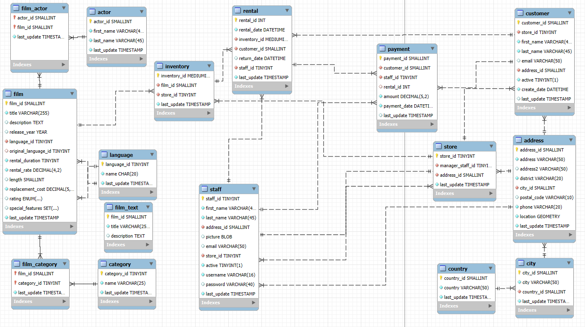

# 🎬 Proyecto SQL - Evaluación Final Módulo 2

Este repositorio contiene la resolución de la evaluación final del Módulo 2 del curso de análisis de datos de [Adalab](https://adalab.es/), enfocado en el manejo de bases de datos relacionales con SQL.

> 📁 Repositorio original: [bda-modulo-2-evaluacion-final-juliabeco](https://github.com/Adalab/bda-modulo-2-evaluacion-final-juliabeco)

---

## ✅ Objetivo

Poner en práctica habilidades de consulta de bases de datos relacionales utilizando SQL, mediante la resolución de un conjunto de ejercicios aplicados a la base de datos **Sakila**, un dataset de ejemplo que simula la estructura y funcionamiento de una tienda de alquiler de películas.

---

## 🧠 ¿Qué temas se trataron?

A lo largo de este ejercicio, apliqué los conocimientos adquiridos durante el módulo, tales como:

- 📌 Consultas básicas con `SELECT`, `WHERE`, `LIKE`, `IN`, `BETWEEN`, `LIMIT`
- 🔗 Relaciones entre tablas usando distintos tipos de `JOIN`
- 🧮 Funciones de agregación como `COUNT`, `AVG`, `MIN`
- 🧠 Subconsultas (`subqueries`) y alias para mejorar la legibilidad
- 📊 Agrupamiento de datos con `GROUP BY` y ordenamientos con `ORDER BY`
- 🧹 Limpieza y exploración de datos previas a la consulta

---

## 🧩 Contenido del repositorio
```
📦 bda-modulo-2-evaluacion-final-juliabeco/
├── evaluacion_juliabeco_M2.sql # Archivo principal con todas las consultas resueltas
├── README.md # Documentación del proyecto
```


---

## 🛠️ Herramientas utilizadas

- SQL (MySQL)
- MySQL Workbench 
- Sakila Database


---

## 📸 Capturas


- 🖥️ Vista general de las tablas de la base de datos en tu cliente SQL




- 📊 Ejemplo de consulta y su resultado 

```sql
-- 19. Existe algún actor o actriz que no apareca en ninguna película en la tabla film_actor.
SELECT a.actor_id, COUNT(fa.film_id) AS cantidad_peliculas
FROM actor AS a
LEFT JOIN film_actor AS fa USING(actor_id)
GROUP BY a.actor_id
HAVING cantidad_peliculas <1; -- NO existe

-- Para chequear cual es el actor que tiene el mínimo actuaciones en peliculas puedo usar el ORDER BY y el LIMIT 
SELECT a.actor_id, COUNT(fa.film_id) AS cantidad_peliculas
FROM actor AS a
LEFT JOIN film_actor AS fa USING(actor_id)
GROUP BY a.actor_id
ORDER BY cantidad_peliculas
LIMIT 1; 
```


- ✅ Captura del archivo `.sql` de consulta y su resultado 


 
 ##
---


